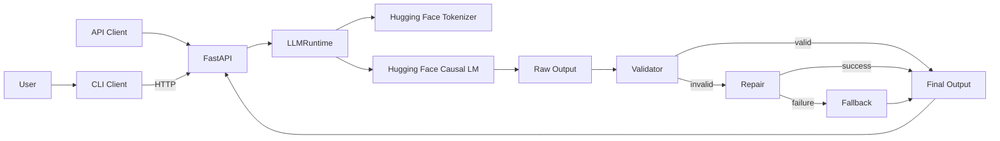
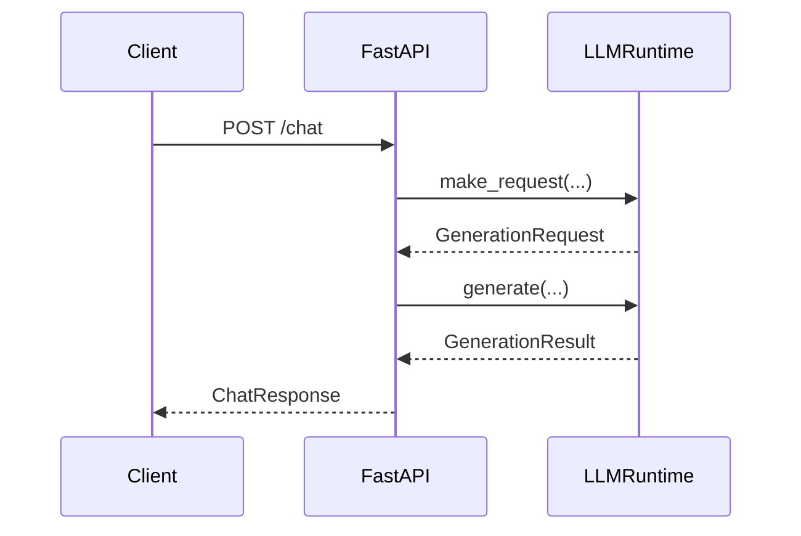
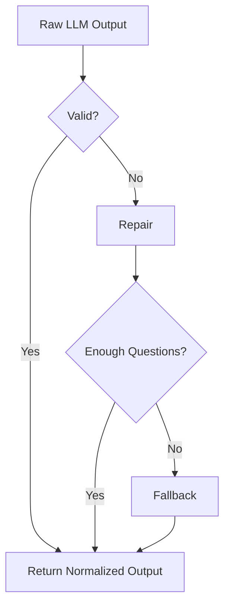
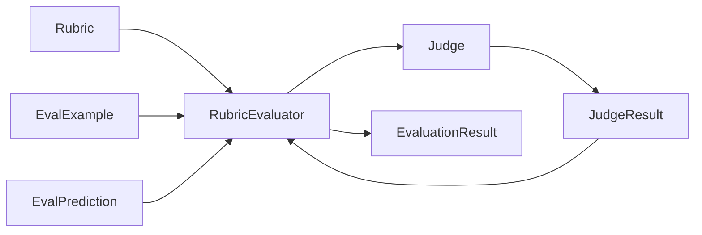

# Architecture — `llm_followups`

## 1. Overview

`llm_followups` is a local LLM application, fine-tuning pipeline, guardrail layer, and evaluation framework built around one strict behavioural contract:

> The model must return only follow-up questions in bullet-list form.

The project originally provided a local Hugging Face model behind FastAPI and a CLI. It now also contains a reusable black-box evaluation architecture with deterministic evaluators, rubric-based LLM-as-a-judge scoring, provider-neutral result models, pluggable dataset sources, and pluggable reporters.

The current design direction is:

> **Black box for input/output, then black box throughout the evaluation pipeline.**

### Current verified status

Latest test results:

```text
pytest -v
34 passed

pytest tests/eval -v
27 passed
```

The only remaining test warnings are FastAPI deprecation warnings for `@app.on_event("startup")`.

---

## 2. High-Level Architecture



The project has three connected systems:

```text
1. APPLICATION
   CLI/API → LLMRuntime → Model → Validate → Repair/Fallback

2. TRAINING
   Topic templates → JSONL dataset → Dataset pipeline → Trainer → Checkpoint

3. EVALUATION
   DatasetSource → Target → Evaluators → Results → Summary/Reporters
```

---

## 3. Repository Structure

```text
ElementalConceptTrainingProgram5/
│
├── data/
│   ├── sft_followups.jsonl
│   ├── sft_followups_train_v3.jsonl
│   ├── sft_followups_eval_v3.jsonl
│   └── sft_followups_v3_report.txt
│
├── outputs/
│   └── ... trained model checkpoints
│
├── scripts/
│   ├── make_sft.py
│   ├── run_train.py
│   ├── sanity_infer.py
│   └── run_trulens_eval.py
│
├── src/
│   └── llm_followups/
│       ├── client/
│       │   └── cli.py
│       │
│       ├── server/
│       │   ├── main.py
│       │   ├── schemas.py
│       │   └── llm_runtime.py
│       │
│       ├── tuning/
│       │   ├── dataset.py
│       │   ├── train.py
│       │   ├── validate.py
│       │   └── log.py
│       │
│       ├── utils/
│       │   └── config.py
│       │
│       └── eval/
│           ├── batch_eval.py
│           ├── rubrics.py
│           ├── core/
│           │   ├── models.py
│           │   ├── protocols.py
│           │   ├── runner.py
│           │   └── summary.py
│           ├── datasets/
│           │   └── jsonl.py
│           ├── evaluators/
│           │   ├── format.py
│           │   └── rubric.py
│           ├── judges/
│           │   └── openai.py
│           ├── reporters/
│           │   ├── csv.py
│           │   └── json.py
│           └── targets/
│               └── llm_runtime.py
│
├── tests/
│   ├── conftest.py
│   ├── test_chat_format.py
│   └── eval/
│       ├── test_format_evaluator.py
│       ├── test_jsonl_source.py
│       ├── test_llm_runtime_target.py
│       ├── test_openai_judge.py
│       ├── test_pipeline.py
│       ├── test_reporters.py
│       ├── test_rubric_evaluator.py
│       ├── test_runner.py
│       └── test_summary.py
│
├── pyproject.toml
├── requirements.txt
├── README.md
└── architecture.md
```

---

# Part I — Application Runtime

## 4. FastAPI Server

### File

```text
src/llm_followups/server/main.py
```

The FastAPI layer is the HTTP boundary.

### Responsibilities

- Create the application.
- Create/store `LLMRuntime`.
- Load the model at startup.
- Validate incoming request models.
- Expose model health.
- Forward chat requests to the runtime.
- Convert runtime failures into HTTP errors.

### Endpoints

#### `GET /health`

Returns:

```text
status
model_loaded
model_name
device
adapter_loaded
```

#### `POST /chat`

Accepts a `ChatRequest`, creates a runtime generation request, invokes `LLMRuntime.generate()`, and returns the final validated text as a `ChatResponse`.



The API does not directly handle tokenization, model inference, repair, or fallback generation.

---

## 5. Pydantic API Models

### File

```text
src/llm_followups/server/schemas.py
```

Main API models:

```text
ChatMessage
ChatRequest
ChatResponse
HealthResponse
ErrorResponse
```

`ChatRequest` carries:

```text
messages
max_new_tokens
temperature
top_p
```

Pydantic provides the typed request/response contract before model-specific logic executes.

---

## 6. CLI Client

### File

```text
src/llm_followups/client/cli.py
```

The CLI uses `httpx.AsyncClient` and talks to FastAPI rather than loading the model itself.

### Modes

Interactive:

```powershell
python -m llm_followups.client.cli
```

One-shot:

```powershell
python -m llm_followups.client.cli --once "Explain Docker containers"
```

Interactive commands include:

```text
:reset
:history
:q
:quit
```

Flow:

```text
User
 ↓
CLI
 ↓
HTTP /chat
 ↓
FastAPI
 ↓
LLMRuntime
 ↓
ChatResponse
 ↓
CLI
```

---

## 7. LLMRuntime

### File

```text
src/llm_followups/server/llm_runtime.py
```

`LLMRuntime` owns the model-specific execution path.

### Responsibilities

- Resolve CPU/CUDA execution.
- Load Hugging Face tokenizer.
- Load Hugging Face causal language model.
- Configure padding.
- Move model to device.
- Build generation prompts.
- Validate generation parameters.
- Serialize generation through an async lock.
- Run `model.generate()`.
- Decode only newly generated tokens.
- Validate generated text.
- Repair malformed output.
- Produce safe fallback questions.
- Return generation metadata.

### Runtime types

```text
GenerationRequest
GenerationResult
```

`GenerationResult` contains:

```text
raw_text
final_text
used_fallback
used_repair
latency_ms
```

This separation is important because evaluation can inspect both the raw model behaviour and the final guarded response.

### Default model

```text
meta-llama/Llama-3.2-1B-Instruct
```

A local checkpoint can override the configured model through `MODEL_PATH`.

---

## 8. Prompt and Generation Policy

The runtime prompt instructs the model to:

- return exactly the configured number of follow-up questions
- output only questions
- use bullet lines
- end every line in `?`
- avoid introductions
- avoid explanations
- avoid summaries
- avoid numbering
- avoid blank lines
- remain specific to the user request
- use varied wording

The current runtime uses stable greedy generation:

```text
do_sample = False
repetition_penalty = 1.10
no_repeat_ngram_size = 3
```

A minimum generation length is also used to reduce overly short output.

---

# Part II — Validation and Guardrails

## 9. Strict Validator

### File

```text
src/llm_followups/tuning/validate.py
```

The central deterministic validator is:

```python
validate_followup_list(...)
```

It checks:

- non-empty output
- accepted bullet marker
- minimum question count
- question marks
- no non-bullet prose when strict mode is enabled
- normalized output formatting

It returns:

```text
ValidationResult
├── ok
├── num_items
├── errors
└── normalized_text
```

---

## 10. Repair and Fallback

The runtime uses a reliability sequence:



### Repair

```python
try_repair_to_followups(...)
```

Handles malformed forms including:

- dash bullets
- asterisk bullets
- numbered lines
- mixed bullets/numbers
- missing `?`
- duplicate questions

### Fallback

```python
fallback_followups(...)
```

Produces guaranteed-valid questions and contains topic-aware branches for areas such as:

```text
Docker
pytest/testing
FastAPI/API
SQLAlchemy/database
generic topics
```

The API therefore exposes a deterministic output contract on top of a probabilistic model.

---

## 11. Configuration

### File

```text
src/llm_followups/utils/config.py
```

Important environment/configuration values include:

```text
MODEL_NAME
SERVER_HOST
SERVER_PORT
ENDPOINT_CHAT
ENDPOINT_HEALTH
REQUEST_TIMEOUT_S
MAX_NEW_TOKENS
TEMPERATURE
TOP_P
SEED
DEVICE
ADAPTER_PATH
ENFORCE_FORMAT
MIN_QUESTIONS
BULLET_STYLE
```

Current defaults include:

```text
model = meta-llama/Llama-3.2-1B-Instruct
max_new_tokens = 64
temperature = 0.2
top_p = 0.9
min_questions = 3
format enforcement = enabled
```

---

# Part III — Dataset and Fine-Tuning

## 12. SFT Dataset Generation

### Script

```text
scripts/make_sft.py
```

Dataset generation is template-driven around `TopicSpec`.

A topic contains:

```text
subject
components
decisions
tools
constraints
```

The generator creates user prompts and strict assistant follow-up responses.

Representative output:

```json
{
  "messages": [
    {"role": "user", "content": "..."},
    {"role": "assistant", "content": "- ...?\n- ...?\n- ...?"}
  ],
  "max_new_tokens": 128,
  "temperature": 0.2,
  "top_p": 0.9
}
```

### Topic coverage

The dataset contains developer-focused topics including:

- Repository and Unit of Work patterns
- async SQLAlchemy
- FastAPI API design
- Pydantic
- Flask and Docker Compose
- DynamoDB and LocalStack
- S3 and boto3
- Redis
- pytest debugging
- SFT datasets
- local model fine-tuning
- README/project documentation
- `pyproject.toml`
- CLI tooling

### Diversity controls

The generator:

- uses a fixed random seed for reproducibility
- limits repeated question lines
- avoids duplicate complete responses
- varies prompt templates
- validates strict formatting
- supports train/eval splitting
- writes a validation report

---

## 13. Dataset Quality Report

Current v3 report:

```text
Examples: 2000
Strict format failures: 0
Unique question lines: 2326 / 6000
Unique assistant responses: 2000 / 2000
Unique prompts: 600 / 2000
```

This confirms that all generated examples satisfy the strict format and that full assistant response blocks are unique.

---

## 14. Training Dataset Pipeline

### File

```text
src/llm_followups/tuning/dataset.py
```

Supported input modes:

```text
raw_text
chat_messages
```

The pipeline can load either local JSON data or a Hugging Face dataset.

Flow:


For `chat_messages`, user and assistant messages are extracted and converted into training text before tokenization.

---

## 15. Fine-Tuning

### Files

```text
src/llm_followups/tuning/train.py
scripts/run_train.py
```

Training uses:

```text
Hugging Face Trainer
PyTorch
DataCollatorForLanguageModeling
```

The model is trained as a causal language model.

### Current training script configuration

```text
base model: meta-llama/Llama-3.2-1B-Instruct
dataset: data/sft_followups_train_v3.jsonl
format: chat_messages
max_length: 512
shuffle: true
seed: 42

output directory: outputs/llama7
learning rate: 5e-6
batch size: 1
gradient accumulation: 1
epochs: 2
save steps: 1000
logging steps: 10
device: cuda
fp16: false
bf16: false
```

Training flow:

```text
TrainConfig
 ↓
validate_train_config()
 ↓
resolve_device()
 ↓
load_model_and_tokenizer()
 ↓
build_dataset()
 ↓
summarize_dataset()
 ↓
build_trainer()
 ↓
trainer.train()
 ↓
save model + tokenizer
```

---

## 16. Training Logging

### File

```text
src/llm_followups/tuning/log.py
```

The logging layer supports plain-text and JSON-style logging.

Events include:

```text
dataset_summary
train_start
train_step
train_end
```

It can log to stderr and optionally to a file.

---

## 17. Sanity Inference

### Script

```text
scripts/sanity_infer.py
```

Sanity inference loads a trained local checkpoint and tests raw generation independently of the FastAPI application.

It reports:

```text
prompt
raw model output
strict format validity
validation errors
latency
summary
```

This is used to check checkpoint behaviour before or alongside batch evaluation.

---

# Part IV — Black-Box Evaluation Framework

## 18. Design Goal

The earlier batch evaluation logic was tightly coupled to:

- `LLMRuntime`
- the follow-up validator
- OpenAI
- hard-coded coherence/relevance logic
- JSONL parsing
- CSV/JSON output

The refactor separates these concerns behind contracts.

The central idea is:

```text
DatasetSource
     ↓
Target
     ↓
EvalPrediction
     ↓
Evaluator(s)
     ↓
EvaluationResult(s)
     ↓
Summary + Reporter(s)
```

For LLM-judged metrics:

```text
RubricEvaluator
     ↓
Judge
     ↓
JudgeResult
```

---

## 19. Core Domain Models

### File

```text
src/llm_followups/eval/core/models.py
```

### `EvalExample`

```text
id
input
expected_output
metadata
```

### `EvalPrediction`

```text
example_id
output
raw_output
metadata
```

### `EvaluationResult`

```text
evaluator
score
passed
reason
metadata
```

### `EvaluatedExample`

Groups:

```text
EvalExample
EvalPrediction
list[EvaluationResult]
```

### `JudgeResult`

```text
score
reason
metadata
```

The core result model is provider-neutral. It does not contain fields tied specifically to OpenAI, TruLens, or one metric.

---

## 20. Evaluation Protocols

### File

```text
src/llm_followups/eval/core/protocols.py
```

The framework defines structural interfaces with Python `Protocol`.

### `DatasetSource`

```python
load() -> Sequence[EvalExample]
```

### `Target`

```python
async generate(example: EvalExample) -> EvalPrediction
```

### `Evaluator`

```python
async evaluate(
    example: EvalExample,
    prediction: EvalPrediction,
) -> EvaluationResult
```

### `Judge`

```python
async judge(
    *,
    instructions: str,
    input_text: str,
    output_text: str,
) -> JudgeResult
```

### `Reporter`

```python
write(results: Sequence[EvaluatedExample]) -> Path | None
```

This allows implementations to be replaced without changing orchestration.

Examples:

```text
Real target    ↔ Fake target
OpenAI judge   ↔ Fake judge
JSONL source   ↔ Future DB/API source
CSV reporter   ↔ JSON reporter
```

---

## 21. EvaluationRunner

### File

```text
src/llm_followups/eval/core/runner.py
```

The runner orchestrates components but does not know their implementations.

Conceptually:

```python
prediction = await target.generate(example)

for evaluator in evaluators:
    result = await evaluator.evaluate(example, prediction)
```

The runner therefore has no direct dependency on:

```text
Hugging Face
OpenAI
JSONL
CSV
follow-up validation internals
```

The current implementation is intentionally sequential. Concurrency can be added later without changing the contracts.

---

## 22. LLMRuntimeTarget

### File

```text
src/llm_followups/eval/targets/llm_runtime.py
```

`LLMRuntimeTarget` adapts the existing runtime to the generic `Target` contract.

```text
EvalExample
 ↓
LLMRuntimeTarget
 ↓
ChatMessage
 ↓
LLMRuntime.make_request()
 ↓
LLMRuntime.generate()
 ↓
EvalPrediction
```

Prediction metadata includes:

```text
latency_ms
used_repair
used_fallback
target = llm_runtime
```

This lets evaluation reuse the working application runtime without refactoring it into the evaluation package.

---

## 23. FollowupFormatEvaluator

### File

```text
src/llm_followups/eval/evaluators/format.py
```

This evaluator wraps the existing deterministic `validate_followup_list()` function.

It returns:

```text
evaluator = followup_format
score = bool
passed = bool
reason = validation errors, when present
metadata:
    num_questions
    normalized_text
```

The runner only sees the generic `Evaluator` contract.

---

## 24. Rubric-Based Evaluation

### File

```text
src/llm_followups/eval/evaluators/rubric.py
```

### `Rubric`

Configuration includes:

```text
name
description
score_levels
pass_threshold
```

### `RubricEvaluator`

Flow:



The evaluator does not know which provider implements the judge.

This separates:

```text
what is measured
```

from:

```text
who performs the judgement
```

---

## 25. Current Rubrics

### File

```text
src/llm_followups/eval/rubrics.py
```

### Coherence

```text
0 = Incoherent or unreadable
1 = Weakly coherent
2 = Mostly coherent
3 = Very coherent, well-structured, and easy to follow

pass threshold = 2.0
```

### Answer relevance

```text
0 = Not relevant to the input
1 = Slightly relevant
2 = Mostly relevant
3 = Directly relevant and useful

pass threshold = 2.0
```

New rubric dimensions can be added as configuration without adding a new OpenAI-specific function for each metric.

---

## 26. OpenAIJudge

### File

```text
src/llm_followups/eval/judges/openai.py
```

`OpenAIJudge` implements the generic `Judge` contract.

Responsibilities:

- build the judge prompt
- invoke the OpenAI client
- request JSON output
- parse JSON
- validate that `score` is numeric
- normalize `reason`
- attach provider/model metadata

Current default judge model:

```text
gpt-4o-mini
```

Returned metadata includes:

```text
judge_provider = openai
judge_model = <configured model>
```

The current OpenAI client call is synchronous, so it is run using:

```python
asyncio.to_thread(...)
```

This preserves the async `Judge` interface without exposing provider-specific behaviour to the rubric evaluator.

---

## 27. JSONLDatasetSource

### File

```text
src/llm_followups/eval/datasets/jsonl.py
```

The source normalizes the existing JSONL formats into `EvalExample`.

Supported shapes include:

```json
{"prompt": "..."}
```

```json
{"user_message": "..."}
```

and SFT-style:

```json
{
  "messages": [
    {"role": "user", "content": "..."},
    {"role": "assistant", "content": "..."}
  ]
}
```

Additional fields are preserved as metadata.

A `limit` supports small test/evaluation runs.

---

## 28. Reporters

### Files

```text
src/llm_followups/eval/reporters/csv.py
src/llm_followups/eval/reporters/json.py
```

### `JSONReporter`

Writes the complete provider-neutral dataclass result structure.

### `CSVReporter`

Writes the main columns directly and serializes nested prediction metadata and evaluation results as JSON strings.

Reporter separation means future outputs such as MLflow or database storage can be added without changing the runner.

---

## 29. Summary Aggregation

### File

```text
src/llm_followups/eval/core/summary.py
```

Current batch metrics:

```text
count_example
average_latency_ms
fallback_rate
repair_rate
```

Per evaluator:

```text
score_count
average_score
pass_count
pass_rate_percentage
```

For `followup_format` a compatibility/convenience field is also generated:

```text
format_valid_percentage
```

Boolean scores are deliberately not included in numeric score averages.

---

## 30. Batch Evaluation Composition

### File

```text
src/llm_followups/eval/batch_eval.py
```

`batch_eval.py` is now intended to be the composition root.

Conceptually it wires:

```text
Settings
 ↓
JSONLDatasetSource
 ↓
LLMRuntime
 ↓
LLMRuntimeTarget
 ↓
EvaluationRunner
 ├── FollowupFormatEvaluator
 ├── RubricEvaluator(COHERENCE_RUBRIC)
 └── RubricEvaluator(RELEVANCE_RUBRIC)
          ↓
      OpenAIJudge
 ↓
EvaluatedExample[]
 ↓
summarise_results()
 ↓
CSVReporter + JSONReporter
```

Implementation details live behind the relevant adapters rather than inside the runner.

---

## 31. Evaluation CLI

### Script

```text
scripts/run_trulens_eval.py
```

The script is now a thin entry point to `run_batch_evaluation()`.

Arguments include:

```text
--data_path
--output_dir
--model_path
--limit
--min_questions
--bullet_style
```

The filename retains the earlier TruLens naming, but the current architecture is no longer limited to TruLens-specific evaluation.

---

# Part V — Testing Architecture

## 32. Original Application Tests

### File

```text
tests/test_chat_format.py
```

The original tests cover:

- `/health`
- `/chat`
- JSONL validity
- Pydantic compatibility
- assistant bullet formatting
- no numbered lists
- minimum question count

A `DummyRuntime` is injected into FastAPI tests instead of loading the real model.

This was already an early black-box substitution pattern.

---

## 33. Evaluation Tests

### `test_runner.py`

Tests:

- fake `Target`
- fake `Evaluator`
- multiple evaluators
- zero evaluators

### `test_format_evaluator.py`

Tests:

- valid output
- invalid prose
- wrong bullet style

### `test_rubric_evaluator.py`

Uses a fake judge to test:

- judge delegation
- rubric rendering
- threshold pass/fail
- no-threshold behaviour
- metadata forwarding

### `test_openai_judge.py`

Uses a fake OpenAI-style client and tests:

- valid JSON parsing
- numeric score normalization
- invalid score rejection
- empty response rejection
- invalid JSON rejection

No real API request is made.

### `test_llm_runtime_target.py`

Uses a fake runtime and checks:

- conversion from `EvalExample` to `ChatMessage`
- generation parameter forwarding
- conversion to `EvalPrediction`
- runtime metadata forwarding

### `test_jsonl_source.py`

Tests:

- SFT message input
- `prompt`
- `user_message`
- IDs
- metadata
- limits
- unusable rows
- malformed JSON

### `test_reporters.py`

Tests:

- JSON writing
- CSV writing
- nested metadata serialization
- evaluation serialization

### `test_summary.py`

Tests:

- average latency
- fallback rate
- repair rate
- format pass rate
- average rubric score
- empty results
- boolean score handling

### `test_pipeline.py`

Runs the architecture end-to-end with no external services:

```text
JSONLDatasetSource
 ↓
FakeTarget
 ↓
EvaluationRunner
 ├── FollowupFormatEvaluator
 └── RubricEvaluator
        ↓
      FakeJudge
 ↓
Summary
 ↓
JSONReporter
```

---

# Part VI — End-to-End Flows

## 34. Runtime Flow

```text
User
 ↓
CLI/API
 ↓
ChatRequest
 ↓
LLMRuntime.make_request()
 ↓
Prompt
 ↓
Tokenizer
 ↓
Hugging Face model.generate()
 ↓
Raw output
 ↓
Validate
 ├── valid
 ├── repair
 └── fallback
 ↓
Final output
 ↓
ChatResponse
```

---

## 35. Training Flow

```text
TopicSpec definitions
 ↓
Prompt/question templates
 ↓
SFT JSONL generation
 ↓
Strict validation
 ↓
Train/eval data
 ↓
DatasetConfig
 ↓
Text preparation
 ↓
Tokenizer
 ↓
Hugging Face Trainer
 ↓
Fine-tuned checkpoint
 ↓
Sanity inference
```

---

## 36. Evaluation Flow

```text
Evaluation JSONL
 ↓
DatasetSource
 ↓
EvalExample
 ↓
Target
 ↓
EvalPrediction
 ↓
Evaluators
 ├── Follow-up format
 ├── Coherence rubric → Judge
 └── Relevance rubric → Judge
 ↓
EvaluationResult[]
 ↓
EvaluatedExample
 ↓
Summary + CSV + JSON
```

---

# Part VII — Architectural Principles

## 37. Separation of Concerns

| Area | Responsibility |
|---|---|
| `client/` | User interaction |
| `server/` | HTTP boundary and model runtime |
| `tuning/` | Validation, dataset preparation, training |
| `eval/core/` | Provider-neutral evaluation domain |
| `eval/targets/` | Systems-under-test adapters |
| `eval/evaluators/` | Evaluation strategies |
| `eval/judges/` | LLM judge providers |
| `eval/datasets/` | Evaluation input adapters |
| `eval/reporters/` | Result persistence |
| `scripts/` | Executable entry points |
| `tests/` | Behaviour and architecture verification |

---

## 38. Contract-Driven Design

The project applies explicit contracts at several boundaries:

```text
HTTP:
Pydantic schemas

Generation:
GenerationRequest → GenerationResult

Output reliability:
raw output → validator → final output

Evaluation target:
EvalExample → EvalPrediction

Evaluation:
EvalExample + EvalPrediction → EvaluationResult

Judge:
instructions + input + output → JudgeResult

Reporting:
EvaluatedExample[] → persisted output
```

---

## 39. Black-Box Principle

At the outer boundary:

```text
input → target → output
```

The evaluator does not need access to hidden model internals.

The refactor extends the same principle through the evaluation system:

```text
DatasetSource
 ↓
Target
 ↓
Evaluator
 ↓
Judge
 ↓
Reporter
```

Every major stage is replaceable behind a contract.

---

# Part VIII — Packaging and Dependencies

## 40. Packaging

The project uses:

```text
pyproject.toml
setuptools
src/ layout
```

Package:

```text
llm-followups
```

CLI entry point:

```text
llm-followups = llm_followups.client.cli:main
```

Project metadata supports Python:

```text
>= 3.13
```

The latest successful local test run was performed with Python 3.14.0.

### Main stack

Application:

```text
FastAPI
Uvicorn
Pydantic
httpx
```

Model/training:

```text
PyTorch
Transformers
Datasets
Accelerate
```

Evaluation:

```text
custom protocol-based evaluation framework
OpenAI SDK
deterministic validators
rubric-based scoring
```

Testing:

```text
pytest
pytest-asyncio
FastAPI TestClient
```

Data/results:

```text
JSONL
JSON
CSV
```

---

# Part IX — Current Limitations / Technical Debt

## 41. FastAPI startup lifecycle

The server currently uses:

```python
@app.on_event("startup")
```

FastAPI now warns that this is deprecated in favour of lifespan handlers.

This is non-blocking but should eventually be migrated.

## 42. Sequential evaluation

`EvaluationRunner` currently evaluates sequentially.

This is simple and deterministic but will be slower for large API-backed judge workloads.

A future implementation can add bounded async concurrency without changing the public protocols.

## 43. Judge providers

The architecture supports generic judges, but the current concrete provider is OpenAI.

Future adapters could include:

```text
AnthropicJudge
LocalModelJudge
HTTPJudge
```

## 44. PEFT adapter loading

`LLMRuntime` has adapter-path support in configuration, but PEFT loading is currently a stub.

## 45. Greedy runtime generation

The runtime currently uses:

```text
do_sample = False
```

so generation is intentionally stable.

`temperature` and `top_p` remain part of the request/config contract but only affect generation when sampling is enabled.

## 46. Bullet-style prompt

Validation supports dash, asterisk, or either, but the current runtime prompt is strongly dash-oriented.

The prompt builder could later be made fully aware of the configured bullet style.

## 47. Rubric score-range validation

The OpenAI adapter verifies that the judge returns a numeric score.

The current generic path does not additionally reject scores outside the rubric's declared levels.

## 48. Evaluation script name

`run_trulens_eval.py` retains the earlier filename even though the evaluation architecture is now generic.

A future rename such as:

```text
run_eval.py
```

would better describe its current role.

---

# Part X — Extension Points

## 49. Add a new evaluator

Implement the `Evaluator` protocol.

Examples:

```text
ExactMatchEvaluator
JSONSchemaEvaluator
RegexEvaluator
SemanticSimilarityEvaluator
SafetyEvaluator
```

No runner changes are required.

## 50. Add a new judge

Implement the `Judge` protocol.

`RubricEvaluator` remains unchanged.

## 51. Add a new target

Implement:

```python
async generate(example: EvalExample) -> EvalPrediction
```

Possible targets:

```text
HTTP agent
LangGraph workflow
RAG pipeline
remote LLM API
local model
arbitrary Python service
```

## 52. Add a new dataset source

Implement:

```python
load() -> Sequence[EvalExample]
```

Possible sources:

```text
CSV
PostgreSQL
S3
API
in-memory data
```

## 53. Add a new reporter

Implement:

```python
write(results)
```

Possible outputs:

```text
MLflow
database
S3
HTML
console/dashboard
```

---

# Part XI — Recommended Next Steps

## 54. Immediate

1. Run a small real evaluation with `--limit 5`.
2. Inspect JSON and CSV output.
3. Verify coherence/relevance judge scores.
4. Verify `used_repair` and `used_fallback` metadata.
5. Verify batch summary calculations.
6. Increase the evaluation size once the real pipeline is correct.

## 55. Near-Term

Useful follow-up improvements:

- migrate FastAPI startup to lifespan
- add bounded evaluation concurrency
- add judge retry/timeout handling
- validate judge score ranges
- calibrate LLM judge results against a human-labelled sample
- add more rubric dimensions
- add regression thresholds
- optionally add MLflow reporting
- rename `run_trulens_eval.py`
- expand target adapters

---

## 56. Final Architecture Summary

```text
APPLICATION

CLI / FastAPI
      ↓
  LLMRuntime
      ↓
Local Hugging Face Model
      ↓
Validate → Repair → Fallback
      ↓
Contract-compliant response


TRAINING

Topic templates
      ↓
SFT JSONL
      ↓
Validation
      ↓
Dataset + Tokenizer
      ↓
Trainer
      ↓
Fine-tuned checkpoint


EVALUATION

DatasetSource
      ↓
Target
      ↓
EvalPrediction
      ↓
Evaluator(s)
   ├── deterministic format
   └── rubric → Judge
      ↓
EvaluationResult
      ↓
Summary + Reporter(s)
```

The important architectural change is that evaluation is no longer designed as one implementation-aware batch script.

Instead, the framework is built around replaceable black-box contracts:

```text
DatasetSource
Target
Evaluator
Judge
Reporter
```

with `EvaluationRunner` responsible only for orchestration.

This is the current implementation of the design goal:

> **Black box at the input/output boundary, and black box throughout the evaluation pipeline.**
